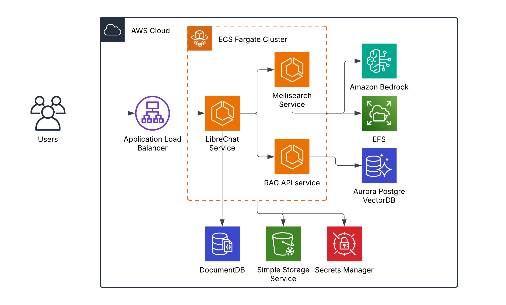

# LibreChat AWS Deployment Guide [Work in Progress]

## Architecture Overview



## Prerequisites

1. **Local Development Environment**
   - Node.js (v14.x or later)
   - AWS CDK CLI (`npm install -g aws-cdk`)
   - Docker Desktop installed and running
   - AWS CLI installed and configured
   - Git

2. **AWS Account Requirements**
   - AWS Account with administrative privileges
   - AWS CLI configured with appropriate credentials
   - A registered domain in Route53 (if using HTTPS)
   - SSL certificate in AWS Certificate Manager (if using HTTPS)

## Configuration Steps

1. **Clone the Repository**
   ```bash
   git clone <repository-url>
   cd librechat-cdk
   ```

2. **Install Dependencies**
   ```bash
   npm install
   ```

3. **Configure the Application**

   Update the following configuration files based on your requirements:

   a. **config/default-config.json**
   - VPC Configuration
   - Region settings
   - Container images
   - Database configurations
   - Domain settings (if using HTTPS)
   ```json
   {
     "vpc": {
       "useExisting": false,
       "newVpc": {
         "maxAzs": 2,
         "natGateways": 1,
         "cidr": "10.0.0.0/16"
       }
     },
     "domain": {
       "name": "your-domain.com",
       "certificateArn": "arn:aws:acm:region:account:certificate/certificate-id"
     }
   }
   ```

   b. **config/Libre_config/librechat.env**
   - Environment-specific configurations
   - API keys and authentication settings
   - Feature toggles and limits

   c. **config/Libre_config/librechat.yaml**
   - Application configuration
   - Endpoints and API settings
   - File upload limits
   - Regional settings

## Deployment Steps

1. **Bootstrap AWS Environment** (First time only)
   ```bash
   cdk bootstrap aws://ACCOUNT-NUMBER/REGION
   ```

2. **Review Infrastructure Changes**
   ```bash
   cdk diff
   ```

3. **Deploy the Stack**
   ```bash
   cdk deploy --all
   ```

## Important Notes

1. **HTTP vs HTTPS**
   - If domain and certificate ARN are configured, the application will be deployed with HTTPS (port 443)
   - Without domain configuration, the application will use HTTP (port 80)

2. **Docker Requirements**
   - Ensure Docker Desktop is running before deployment
   - The CDK stack uses Docker to build and push container images

3. **Cost Considerations**
   - The deployment includes:
     - DocumentDB cluster
     - Aurora PostgreSQL cluster
     - NAT Gateway
     - Application Load Balancer
     - ECS Fargate containers
   - Review the AWS pricing calculator for estimated costs

4. **Security**
   - Update all API keys and secrets in librechat.env
   - Follow AWS security best practices
   - Regularly update container images and dependencies

## Troubleshooting

1. **Common Issues**
   - Docker not running: Ensure Docker Desktop is started
   - CDK bootstrap errors: Verify AWS credentials and permissions
   - Domain/SSL issues: Verify certificate ARN and domain configuration

2. **Logs and Monitoring**
   - CloudWatch Logs for container logs
   - CloudWatch Metrics for performance monitoring
   - AWS X-Ray for distributed tracing (if enabled)

## Clean Up

To remove all deployed resources:
```bash
cdk destroy --all
```

**Note:** This will delete all resources including databases. Ensure you have backups if needed.

## Support and Resources

- [LibreChat Documentation](https://docs.librechat.ai)
- [AWS CDK Documentation](https://docs.aws.amazon.com/cdk/)
